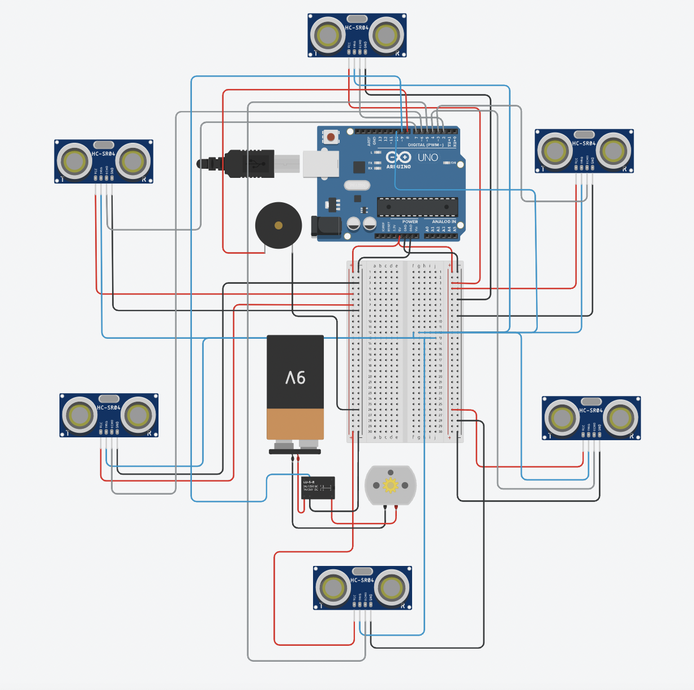

# Smart car proximity detection system

The proximity sensing solution can be arranged around the car, while providing proximity data from different directions, and not only providing the driver feedback on distance and direction but also including a failsafe to engage the brakes if the driver is unable to do so in time.

## Circuit

